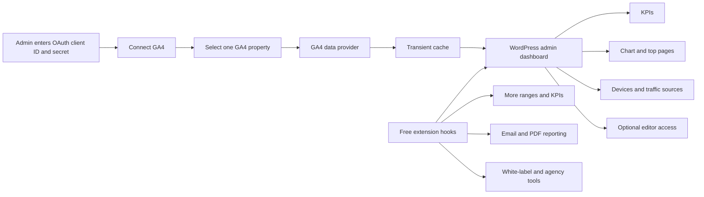
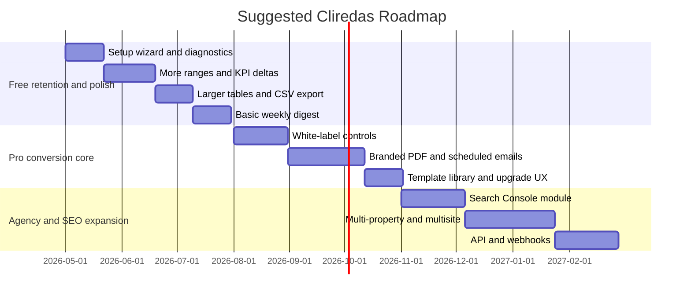

# Strategic Analysis of Cliredas Analytics Dashboard

## Executive Summary

Cliredas is already a real, working MVP rather than a speculative concept. The public plugin page and repository show a live GA4 connection flow, one-property selection, four KPI cards, a sessions/users chart toggle, top-pages reporting, device and traffic-source breakdowns, 15-minute caching, a cache-clear control, and optional editor access. Public metadata also shows that the plugin is still very early: WordPress.org lists version 1.0.1, updated four weeks ago, with fewer than 10 active installs and no reviews, while the public repository shows 26 commits, no public issues, no stars, and no forks. citeturn38view1turn39view0

The product’s main weakness is not the lack of a core analytics dashboard. It is the lack of a full reporting workflow. That is where competing WordPress plugins and agency-reporting SaaS products are strongest: richer date controls, comparison views, exports, scheduled emails, PDF delivery, white-labeling, multi-property and multisite management, SEO overlays, and client-facing automation. The uploaded comparison PDF and the public build plan point in that same direction, but several of those future capabilities are still only partially specified in public. fileciteturn0file0 citeturn37view0turn25search3turn29view0turn28view5turn27view12

The strongest strategic path is to keep Free focused on “client-ready GA4 inside WordPress,” while moving only a few table-stakes capabilities into Free to improve adoption and habit formation: more preset ranges, previous-period deltas, a larger top-pages view, and a light export or digest feature. Pro should monetize agency workflow, not raw data access: branded email and PDF reports, white-label controls, Search Console, multi-property and multisite operations, templates, and API or webhook automation. That approach fits both the current architecture and the market: lower-complexity and lower-cost than multi-source SaaS, but more client-reporting-oriented than the official free alternatives. citeturn37view0turn13view1turn20search4turn20search3turn27view6turn28view5

## Evidence Base and Product Snapshot

This report prioritizes primary sources: the public plugin page on entity["organization","WordPress.org","plugin directory"], the public repository on entity["company","GitHub","code hosting"], the repository build plan, the official WordPress screenshots, and the uploaded Free-vs-Pro comparison PDF. Competitor comparisons below rely primarily on official pricing, feature, and documentation pages from the vendors themselves. citeturn38view1turn39view0turn37view0turn18view0turn18view1 fileciteturn0file0

The product is publicly framed as a clean, client-friendly GA4 dashboard inside WordPress admin, intended to show key GA4 metrics without sending clients into the GA4 interface. The repository README confirms that this repo is the Free version intended for WordPress.org, and that a separate Pro add-on is planned. The public repo navigation and tabs also show that the public issue list is currently empty, which means the build plan and the uploaded PDF carry more roadmap signal than the issue tracker does. citeturn38view1turn39view0

Technically, the current product is a narrowly scoped GA4 dashboard with a sensible extension surface. It uses a local Chart.js bundle rather than a CDN, loads localized data into the dashboard script, checks AJAX nonces and capabilities, caches GA4 reports in transients with a default 15-minute TTL, and tracks cache entries so they can be cleared from the UI. The dashboard stores OAuth credentials and tokens in the `cliredas_settings` option and currently requests only the GA4 read-only scope. The build plan also lists an unusually healthy set of extension points for Free-to-Pro growth, including hooks for ranges, KPIs, section blocks, cache TTL, OAuth scopes, capability rules, and data providers. citeturn36view0turn33view6turn33view7turn16view3turn38view1turn9view9turn37view3

The public screenshots confirm that the current UX is card-and-table based, not a dense analytics console. The dashboard screenshot shows four KPI cards, a chart with a metric toggle, a top-pages table, a device table, and a traffic-sources chart and table. The settings screenshot shows OAuth fields, connection status, property selection, editor visibility, and a cache-clear tool. That makes the current positioning visually coherent: simple, readable, and designed for WordPress admin users rather than analysts. citeturn18view0turn18view1

## Free Feature Inventory and Planned Pro Surface

The current Free inventory is concrete enough to evaluate from three angles at once: public copy on the plugin page, implementation details in public code, and the two official screenshots. The build plan then adds a useful fourth lens because it shows which parts of the architecture were intentionally built as extension points for later monetization. citeturn38view1turn39view0turn37view3turn18view0turn18view1

| Area | Current Free capability | Publicly mentioned future Pro capability | Specificity and analytical note | Evidence |
|---|---|---|---|---|
| GA4 connection | OAuth-based GA4 connection, no service account required; connect, disconnect, and reconnect flows exist. | None beyond expanded reporting modules. | Current implementation is concrete and public. | Official plugin page and code citeturn38view1turn12view0turn9view9 |
| Property model | One active GA4 property per WordPress site, selected from a dropdown. | Multiple GA4 properties and site switching. | Current one-property design is explicit; multi-property is mentioned in the PDF but not broken into milestones in the public build plan. | Current public docs/code and PDF citeturn39view0turn8view3turn12view1 fileciteturn0file0 |
| KPI layer | Sessions, Total Users, Pageviews, Avg engagement time. | “More flexibility over metrics shown”; Pro milestone P2 also says Pro can add KPIs via hooks. | The future metric list is underspecified; the extension mechanism is specified. | Public dashboard code and build plan citeturn14view0turn14view1turn37view0 |
| Time controls | Last 7 days and Last 30 days. | This month, last month, last 90 days, custom range, previous-period comparison. | Extra date ranges are concrete enough to build soon; previous-period comparison is only explicit in the PDF. | Current code, PDF, build plan citeturn7view1turn7view2turn37view0 fileciteturn0file0 |
| Charting | Line chart with metric toggle between Sessions and Total Users; local Chart.js bundle. | More section blocks and richer metrics. | The chart surface is already extendable and low-friction for more series. | Code and build plan citeturn8view5turn36view0turn37view3 |
| Top pages | Top-pages table with title, URL, sessions, views, avg engagement time; current GA4 query fetches 25 rows but UI slices to 10. | More rows, more metrics, export option. | This is one of the clearest low-effort opportunities because the backend already over-fetches. | Public code and PDF citeturn14view2turn9view6turn13view1turn17view7 fileciteturn0file0 |
| Device and traffic sources | Device table and traffic-source chart/table; traffic buckets normalize to Organic Search, Direct, Referral, Social, Other. | No detailed public Pro breakdown beyond “richer tables” and Search Console. | Current segmentation is simple and client-readable. | Dashboard and provider code citeturn9view3turn7view5turn9view7turn17view6 |
| Access control | Admins by default; optional editor visibility; capability filter exists. | Additional role control and white-label menu name. | Role granularity beyond editor is not yet public; menu-name customization aligns with both the PDF and white-label plans. | Settings/menu code, build plan, PDF citeturn9view4turn16view0turn10view0turn37view3 fileciteturn0file0 |
| Caching | Built-in report caching, default 15 minutes, cache-clear on dashboard/settings, property/range-aware cache keys. | Cache-tuning options. | This area is already architected for paid extensions; cache TTL is filterable today. | Plugin page, code, build plan citeturn38view1turn11view0turn11view3turn11view4turn37view3 |
| Reporting and exports | No public CSV/PDF export or scheduled reporting in Free. | Automatic weekly/monthly email reports; PDF export. | Scheduled reporting is a concrete Pro milestone; PDF export is named in the PDF but not milestone-scoped publicly. | Build plan and PDF citeturn37view0 fileciteturn0file0 |
| Branding and white-label | Current dashboard is branded as “Client Report”; repo/build plan include a Pro placeholder surface. | Custom logo, brand colors, remove “powered by,” white-label menu name, hide upgrade link, CSS override. | Branding is one of the clearest Pro anchors, and parts of it are explicitly milestone-scoped. | Admin menu/build plan/PDF citeturn10view0turn37view0 fileciteturn0file0 |
| Agency operations | Basic single-site admin workflow only. | Settings import/export, default templates, multisite support. | These are in the PDF, but they are still vague in public milestone language. | PDF and build plan context fileciteturn0file0 citeturn37view0 |
| Integrations | GA4 only, using OAuth, Analytics Admin API, and Analytics Data API. | Search Console integration with clicks, impressions, and average position. | Search Console is named clearly in the PDF, but the public code currently only uses the GA4 read-only scope, so this would enlarge the permission and implementation surface. | Plugin page, code, PDF citeturn38view1turn9view9 fileciteturn0file0 |

Several future Pro items remain publicly underspecified. “More flexibility over metrics,” “richer tables,” and “additional role control” are useful directional ideas, but they are not yet decomposed into admin UX, data model changes, or entitlement boundaries. Search Console, PDF export, settings import/export, default templates, and multisite support are all named publicly, but they are not yet paired with public issue-level prioritization because the repository currently shows 0 public issues. Public Pro pricing is also unspecified: the UI and repo both say “Pro (Coming Soon),” and the build plan discusses licensing and dependency checks without publishing a price. citeturn10view0turn39view0turn37view0 fileciteturn0file0

## Target Users and Use Cases

Following your assumption, the most realistic core market is small agencies and site owners. The public product copy supports that. The plugin is explicitly described as a clean, client-friendly GA4 dashboard inside WordPress admin, designed to show key GA4 metrics without sending clients to the GA4 interface, and the uploaded PDF explicitly frames Pro as most valuable for freelancers and agencies that need recurring client reporting. citeturn38view1 fileciteturn0file0

Today, the strongest-fit user is the owner or operator of a single WordPress site who wants the essential GA4 picture without opening the GA4 UI. The current product is especially well aligned with that job because it is one-property-per-site, visually simple, and already includes the most common summary blocks: KPIs, trend line, top pages, devices, and source buckets. The optional editor access toggle also makes it practical for content or marketing collaborators who live inside WordPress but do not need full GA4 access. citeturn39view0turn14view2turn7view5turn9view3turn16view0

The second-fit user is the freelancer managing a small handful of WordPress sites. That user benefits from the current simplicity, but will quickly ask for comparison periods, broader date presets, export, and lightweight email digests. In other words, Cliredas already solves their “show me the answer in WordPress” problem, but it does not yet solve their “share and operationalize the answer repeatedly” problem. That is precisely where the PDF’s agency features and the Pro milestones begin to matter. citeturn7view1turn7view2turn37view0 fileciteturn0file0

The product is not currently a strong fit for enterprise marketing operations or cross-channel performance teams. Competing agency-reporting and BI products such as Looker Studio, Whatagraph, AgencyAnalytics, and Databox emphasize many more integrations, team administration, and more fully automated reporting workflows. Cliredas should therefore be positioned as a WordPress-embedded client-reporting layer for GA4, not as a generic BI suite. Among agency-SaaS benchmarks, entity["company","AgencyAnalytics","marketing reporting"], entity["company","Whatagraph","marketing intelligence"], and entity["company","Databox","analytics software"] define the standard for white-label automation; Cliredas should borrow that workflow logic without trying to match their full breadth of integrations. citeturn26view14turn29view3turn29view4turn26view12turn27view12

| User segment | Primary job to be done | Current fit | What would make Pro compelling |
|---|---|---|---|
| Site owner or founder | See core traffic health in WordPress without GA4 complexity | Strong | PDF/email summaries, richer date presets, comparison deltas |
| Content editor or internal stakeholder | View site performance without full analytics access | Moderate to strong | Safer role granularity, stakeholder-friendly notes and exports |
| Solo freelancer | Reuse a dashboard across a few client sites | Moderate | Scheduled reports, templates, branding, faster onboarding |
| Small agency account manager | Deliver recurring client updates under agency branding | Weak today | White-label, multi-recipient email/PDF, Search Console, portfolio workflows |
| Enterprise analytics or multi-channel team | Manage many sources, deep governance, and cross-channel analysis | Weak | Not a core target; better served by multi-source BI/reporting platforms |

## Competitive Landscape

The market around Cliredas splits into three groups. First, there are direct WordPress dashboard alternatives. Second, there are privacy-first WordPress analytics tools that compete for “keep it in WordPress” mindshare even when they are not GA4-dependent. Third, there are agency-reporting and BI platforms that compete for higher-value reporting workflow, especially white-label delivery and cross-client operations. Prices below are public snapshots from official pages as of 2026-04-17; some vendors explicitly mark them as promotional or annually billed. citeturn20search4turn31view1turn27view11turn30search0turn27view6turn28view5turn27view12

| Competitor | Category | Pricing snapshot | Notable features | UX / reporting model | Integrations | Target market | Strategic read for Cliredas | Evidence |
|---|---|---|---|---|---|---|---|---|
| Site Kit by Google | WordPress plugin, direct baseline | Free | Analytics, Search Console, PageSpeed Insights, AdSense, Google Ads, Tag Manager | Official WordPress dashboard for Google services | Google services | Site owners, developers, agencies | The strongest free benchmark; Cliredas must beat it on client readability and reporting workflow, not breadth of Google modules | Official pages citeturn20search0turn20search4turn26view9 |
| MonsterInsights | WordPress plugin, premium direct competitor | From $99.50/year for Plus; Pro $199.50/year; Agency $399.50/year on current vendor page | In-dashboard reports, email summaries, PDF export, campaign reports, eCommerce and form tracking, PPC tracking, user journeys | Polished WP-native reporting with many business-focused reports | WooCommerce, EDD, WPForms, ad platforms, 12+ other integrations | SMBs, publishers, eCommerce, agencies | Best benchmark for “premium WordPress analytics UX”; Cliredas should not out-bloat it, but can undercut it by being simpler and more agency-reporting-oriented | Official pricing/features citeturn32view2turn31view1turn26view10 |
| Analytify | WordPress plugin, premium direct competitor | Agency plan $199/year, unlimited sites, all premium add-ons | GA4 dashboarding, WooCommerce support, automated email reports, dashboard widget, forms/authors/outbound/affiliate/event tracking | WordPress-native but add-on-heavy | GA4 plus eCommerce and marketing add-ons | Site owners, marketers, agencies | Strong competitor if Cliredas stays too narrow; also shows that email reporting and bundle logic already exist in this price zone | Official pricing/plugin pages citeturn27view11turn24search2turn24search6 |
| Independent Analytics | WordPress plugin, privacy-first indirect/direct competitor | Free; Pro Standard $49/year, Hobbyist $79/year, Agency $199/year | Privacy-friendly native analytics; Pro adds UTM tracking, real-time, click tracking, eCommerce, user journeys, forms, HTML email reports | Simple WordPress-admin UX | Form and eCommerce plugins; can run alongside GA | Privacy-conscious site owners and small pros | Important warning: a very simple WordPress-native UX can still be commercially competitive when paired with retention features like email and journeys | Official pages citeturn21search12turn25search4turn27view9turn25search0 |
| WP Statistics | WordPress plugin, privacy-first premium alternative | Free; Premium $119/year for 1 site, $249/year for 5, $449/year unlimited | No cookies/no PII by default; premium adds Search Console, campaign analytics, custom events/goals, scheduled PDF/HTML reports, REST API, white-label | Feature-dense, all-in-one WordPress analytics | Primarily local WP data plus Search Console | Site owners, marketers, agencies needing privacy-first analytics | A powerful benchmark for what “agency-ready WordPress analytics” can include without becoming a SaaS | Official pages citeturn25search5turn30search0 |
| Burst Statistics | WordPress plugin, privacy-first alternative | Free plugin; Pro from €68.73/year on current pricing page | Free includes visitors, pageviews, referrers, top content, device stats, goal tracking, email reports; Pro adds geo, referral, UTM, revenue, WooCommerce funnel analytics, automated reporting with Email/PDF export | Lightweight and privacy-first | Runs on your own server; WooCommerce funnel in Pro | Small site owners and privacy-sensitive SMBs | Shows how much value some users already expect in low-cost WordPress analytics, especially email and reporting automation | Official pages citeturn21search10turn21search2turn26view18 |
| AgencyAnalytics | Agency SaaS, indirect but commercially important | From $59/month | 85+ integrations, white-label reports and dashboards, custom logos/colors/URL, client-facing reporting | Portal-style agency reporting | 85+ marketing/data integrations | Agencies | This is the clearest template for Pro’s paid value: branding, recurring delivery, and client operations | Official pages citeturn20search3turn26view14turn25search3 |
| Whatagraph | Agency SaaS, indirect benchmark | Free plan; Start €199/month; Boost €399/month; Max custom | Automated emails with PDF, custom branding, white-label customization, custom report domain, goals/alerts, BigQuery and Looker Studio destinations | Polished, marketer-friendly reporting platform | 62 native integrations listed; 50+ additional integration references | Agencies and in-house marketing teams | Strong benchmark for report automation and polished white-label delivery, but priced far above WordPress-plugin territory | Official pages citeturn27view6turn29view0turn29view1turn29view3turn29view4 |
| Databox | SaaS dashboard and reporting platform | Free $0/month; Pro $159/month; Growth $399/month; Premium $799/month, annual billing snapshots shown publicly | 130+ integrations, automated reports, unlimited users on paid, AI analyst, agency features, white-label add-on | Flexible dashboards plus sharable reports | 130+ native integrations, spreadsheets, APIs, warehouses | Teams, agencies, growth organizations | Shows where higher-end workflow value lives: automation, account ops, and integrations. Cliredas should emulate only the WordPress-relevant parts | Official pages citeturn28view5turn26view12turn28view7turn28view8 |
| Looker Studio | BI/reporting platform, indirect benchmark | Free; Pro $9/user/project/month | Fully customizable dashboards and reports; Pro adds support and expanded admin features; 1000+ datasets from 700+ connectors | Highly flexible, more DIY and analyst-oriented | 700+ connectors, 1000+ data sets | Analysts, ops teams, agencies | Cliredas should not chase full BI flexibility; instead it should win by being dramatically easier inside WordPress | Official pages/docs citeturn27view12turn22search1turn23search7 |

The direct plugin market makes one thing clear: users already expect a lot more than a single traffic chart and a KPI row. Even within WordPress, vendors monetize email summaries, exports, campaign views, SEO overlays, eCommerce metrics, and richer permissions. That means Cliredas cannot rely on “GA4 in WordPress” alone as a durable premium proposition. citeturn31view1turn27view11turn30search0turn21search10

At the same time, the SaaS market makes a second thing equally clear: the highest willingness to pay sits around workflow and delivery. White-labeling, recurring branded distribution, client operations, and multi-source reporting are what justify monthly subscription pricing. Cliredas does not need to become a multi-source SaaS to benefit from that lesson. It only needs to make WordPress-native GA4 reporting genuinely deliverable to clients. citeturn25search3turn29view0turn28view7turn27view12

## Gap Analysis and Commercial Strategy

The product gap is easiest to see through the lens of “what job is unfinished.” Cliredas already answers “what happened on the site?” for one GA4 property. It does not yet fully answer “how do I present that repeatedly, cleanly, and under my own brand?” That is why Site Kit is the free baseline threat, MonsterInsights and Analytify are the premium WordPress feature threats, and AgencyAnalytics/Whatagraph/Databox are the workflow threats. citeturn20search4turn31view1turn27view11turn20search3turn29view0turn28view5

Cliredas can win in three places. First, it can be cleaner and more client-readable than Site Kit, whose value is breadth across Google products rather than client presentation. Second, it can be cheaper and more focused than agency SaaS by staying inside WordPress and limiting scope to the reporting workflows that WordPress-based freelancers and agencies actually need. Third, it can be more monetizable than a “simple dashboard” if its Pro value is centered on delivery: templates, exports, branding, schedules, and multi-site administration. It should not, however, try to win the privacy-first local-tracking battle against WP Statistics, Independent Analytics, or Burst, because Cliredas’s current identity is explicitly GA4-connected and token-based. citeturn26view9turn26view11turn28view7turn25search5turn25search0turn26view18turn38view1

Three planned-or-implied features are especially strong candidates to move from “future Pro” into Free because they are both high-impact and structurally cheap. More preset ranges are low-friction because the current code already exposes a date-range hook and the public Pro milestone explicitly talks about extending ranges. Previous-period deltas are analytically table stakes and fit the existing KPI model. And a bigger top-pages view is unusually cheap because the current provider already requests 25 rows from GA4 and then slices down to 10 in PHP. citeturn7view1turn7view2turn37view0turn13view1turn17view7

By contrast, the strongest paid anchors are the features that either introduce recurring client delivery or operational leverage: white-labeling, scheduled branded emails and PDFs, Search Console, multi-property and multisite workflows, templates and settings portability, and machine-readable exports such as APIs or webhooks. Those are exactly the areas named in the PDF and mirrored by agency-reporting competitors. fileciteturn0file0 citeturn25search3turn29view0turn30search0turn28view7

### Recommended feature packaging

| Recommendation | Tier after change | Why this packaging is strongest | Impact | Effort |
|---|---|---|---|---|
| Add “This month,” “Last month,” and “Last 90 days” presets | Free | Raises usefulness immediately and reduces the feeling of an artificially constrained dashboard | High | Low |
| Add KPI deltas vs previous period | Free | This is one of the most expected analytical affordances and makes the dashboard feel much more complete | High | Low to medium |
| Raise top-pages default from 10 to 25 and add table sorting | Free | The backend already fetches 25 rows; users will perceive this as materially better depth | Medium to high | Low |
| Add a basic CSV export for current dashboard blocks | Free | Improves shareability and validation without undermining branded PDF value | Medium | Low to medium |
| Add a simple weekly admin digest with one recipient and no branding | Free | Increases habit formation and retention; preserves Pro value for client delivery | High | Medium |
| Keep branded multi-recipient scheduled email reports in paid | Pro | This is a true workflow feature and maps directly to recurring client-reporting needs | High | Medium |
| Keep PDF/HTML report generation with templates and notes in paid | Pro | Strong perceived value, strong shareability, and defensible against free baselines | High | Medium |
| Keep full white-labeling in paid | Pro | Branding is one of the cleanest agency monetization levers | High | Medium |
| Build Search Console as a paid module | Pro | It expands the permission surface and adds a distinct SEO use case | High | Medium to high |
| Build multi-property, multisite, template propagation, import/export, and API/webhooks in paid | Pro | These are advanced operational features that agencies will pay for and casual users usually will not need | High | High |

### Positioning and pricing

The best positioning statement is: **client-ready GA4 reporting inside WordPress for freelancers, site owners, and small agencies**. That is more precise than “analytics dashboard,” and more defensible than “all-in-one reporting,” because the current product is already client-friendly, WordPress-native, and GA4-specific. It also creates a clean contrast with Site Kit’s broader utility and with SaaS reporting tools’ broader multi-source scope. citeturn38view1turn20search0turn27view12

For pricing, the most sensible approach is annual, license-based, and visibly cheaper than agency SaaS while remaining credible next to premium WordPress plugins. A practical model would be:

| Suggested plan | Recommended price | Scope |
|---|---:|---|
| Pro Solo | $79/year | 3 sites, scheduled owner reports, PDF export, saved templates |
| Pro Agency | $199/year | 25 sites, white-labeling, Search Console block, multi-recipient branded reports |
| Pro Studio | $349/year | Unlimited sites, multisite tools, settings import/export, API/webhooks, priority support |

That structure lands below Databox, Whatagraph, AgencyAnalytics, and Looker Studio Pro on an annualized workflow basis, while staying in the same mental pricing neighborhood as premium WordPress plugins such as MonsterInsights, Analytify, WP Statistics, and Independent Analytics. It also lets Cliredas monetize the exact agency-use case that the uploaded PDF describes without pretending to be a multi-channel SaaS. citeturn32view2turn27view11turn30search0turn27view9turn20search3turn27view6turn28view5turn27view12 fileciteturn0file0

### Go-to-market tactics

Go-to-market should begin with the WordPress.org funnel, because the plugin’s public footprint is still tiny. The listing has no reviews, very few installs, and only two screenshots. That makes the listing itself a product surface. The biggest immediate gains would come from a better screenshot sequence, a short setup video, a clearer free-vs-pro matrix, and copy that explicitly compares Cliredas with Site Kit and generic GA4 use inside WordPress. citeturn38view1turn18view0turn18view1

The current “Pro (Coming Soon)” submenu is also underused as a conversion surface. It should become a real upgrade page that shows locked report outputs, branded sample PDFs, email templates, and an “agency bundle” story. Right now, the public code and menu structure already reserve that space; the missing piece is commercial clarity, not navigation. citeturn10view0turn39view0

Content marketing should lean into comparison framing: “Site Kit alternative for client reporting,” “GA4 reports from inside WordPress,” “white-label GA4 reports for WordPress agencies,” and “when to use Cliredas instead of Looker Studio or AgencyAnalytics.” This is especially important because Cliredas’s real competitive edge is not a novel metric, but smaller implementation overhead for WordPress-centric teams. That message is easiest to communicate through comparisons, setup guides, and downloadable sample reports. citeturn20search4turn20search3turn27view12

Finally, the plugin should recruit a small design-partner cohort of freelancers and agencies before building the highest-effort Pro features. With install count, review count, and public community activity still so low, real usage feedback is more valuable than speculative feature expansion. citeturn38view1turn39view0

## Technical and UX Recommendations with Suggested Roadmap

From a technical foundation standpoint, the plugin already does several important things right. It bundles Chart.js locally, supports localized initial dashboard data, uses nonce and capability checks for dashboard AJAX and cache clearing, enforces state validation in OAuth, filters capabilities centrally, and structures Pro as an extension layer rather than a fork. Those are good decisions because they reduce rework later. citeturn36view0turn33view6turn33view7turn16view1turn16view0turn37view3

The biggest technical and UX risks are also already visible. Tokens and client secrets are stored in the WordPress options table, local development is awkward because Google OAuth requires a public top-level domain, and the current permissions model is still coarse. The current onboarding asks users to supply Google OAuth credentials manually, copy a redirect URI into Google Cloud, connect, and then choose a property. That is viable for a technical admin, but it is more friction than many small-site owners will tolerate without a wizard and diagnostics. citeturn38view1turn12view1turn12view0

| Area | Recommendation | Why now |
|---|---|---|
| Performance | Add stale-while-revalidate caching so users see the last good report immediately while a background refresh runs; expose cache status and last-refresh timestamps in the UI | The current cache layer and clear-cache tooling already exist, so this is a refinement rather than a rewrite |
| Security | Encrypt stored OAuth secrets and tokens at rest where feasible, add token-health diagnostics, and log connect/disconnect/export events | Credentials are currently stored in `cliredas_settings`; this should be hardened before higher-value reporting and automation features ship |
| Data privacy | Keep GA4 read-only as the default minimum scope, and request additional scopes separately for optional modules such as Search Console | This avoids unnecessary consent expansion and gives clearer upgrade boundaries |
| Onboarding | Build a setup wizard with preflight checks for public domain, redirect URI, OAuth status, property availability, and token refresh | The current manual setup path is a known conversion risk |
| Reporting templates | Add saved report templates for owner, agency, and SEO views | Templates improve time-to-value and make future paid exports more compelling |
| Exports | Add CSV in Free; add branded PDF/HTML/email in Pro | This creates a clean free-to-paid gradient instead of an all-or-nothing reporting story |
| White-labeling | Implement logo, colors, menu title, hide-upgrade control, and customizable report footer | Branding is both monetizable and requested explicitly in the public planning materials |
| Multisite support | Add network activation, network defaults, per-site overrides, and portfolio rollups | This is one of the best agency features, but it should follow onboarding and reporting stability |
| API and webhooks | Add read-only REST endpoints for current reports and signed outbound webhooks for scheduled report delivery or anomaly events | These features increase paid stickiness without forcing Cliredas into full BI scope |
| Visualizations | Add KPI comparison badges, table filters, annotations, sparklines, and clearer “no data” states | These improve perceived polish with relatively contained engineering effort |

The visual roadmap below reflects that sequencing logic: improve retention and usability first, then ship the Pro conversion core, then scale up to agency operations.

| Milestone | Scope | Effort | Main risks |
|---|---|---|---|
| Foundation hardening | Setup wizard, connection diagnostics, better empty states, public-domain preflight, clearer status messaging | Medium | OAuth edge cases, support volume during rollout |
| Free retention release | More presets, comparison deltas, 25-row top pages, CSV export, weekly digest | Medium | Feature creep into paid value if the line is not drawn carefully |
| Pro conversion core | White-label controls, branded PDF/HTML/email scheduling, template system, real upgrade page | High | Deliverability, PDF rendering quality, entitlement complexity |
| SEO module | Search Console integration with clicks, impressions, CTR, average position | Medium to high | New permissions, account linking complexity, support expectations |
| Agency scale release | Multi-property, multisite, settings import/export, API/webhooks | High | Data model complexity, support burden, network-level QA |

The main strategic risk is scope drift. If Cliredas tries to become a general reporting platform, it will run headfirst into vendors with 62, 85, 130, or 700-plus connector ecosystems. If it instead becomes the easiest way to deliver GA4 reports from inside WordPress, it can occupy a much narrower and more defensible space. The second risk is onboarding friction, because the current connection flow depends on Google Cloud OAuth setup and a public domain. The third is support complexity, especially once email delivery, Search Console, and multisite are introduced. Those are exactly the reasons to prioritize retention and usability before deep agency operations. citeturn29view3turn26view14turn26view12turn22search1turn38view1turn12view1turn12view0

The strategic conclusion is straightforward: Cliredas should make Free undeniably useful for a single-site GA4 dashboard inside WordPress, and make Pro undeniably valuable for delivering that insight to clients under an agency’s workflow and brand. The codebase, public roadmap, and market all point in the same direction. What is needed now is tighter product packaging and sharper sequencing, not a reinvention of the core product. citeturn39view0turn37view0turn38view1